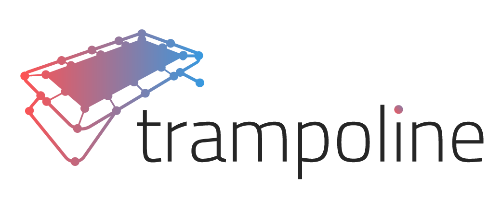

# Trampoline Framework
The framework for developing decentralized applications on Nervos Network's layer 1 blockchain, the Common Knowledge Base (CKB). Trampoline provides a host of capabilities for running & configuring a local development environment, creating and managing projects, testing smart contracts, and managing complex business logic with an SDK that provides an intuitive API for sophisticated transaction generation.

Trampoline currently provides the following features:
- Quickly generate new dapp projects
- Launch local nodes, miners, and chain indexers
- Generate custom schemas for on-chain data
- Smart contract pipelines for easy composability & transaction creation
- A simulation chain for building sophisticated test cases with ease
- Builtin support for tNFT's and SUDT fungible tokens

Trampoline is still under heavy development and is subject to breaking changes. Please use for testing & experimentation *only* at this stage.
# Installation
Currently, Trampoline has only been tested on Linux environments.

Trampoline uses docker for running chain services like nodes and miners, so it is recommended to [install docker](https://docs.docker.com/get-docker/) before moving on.

Then, install with `cargo install --git https://github.com/WilfredTA/trampoline --branch develop`

# Trampoline CLI

## Usage
```
USAGE:
    trampoline <SUBCOMMAND>

FLAGS:
    -h, --help       Prints help information
    -V, --version    Prints version information

SUBCOMMANDS:
    help       Prints this message or the help of the given subcommand(s)
    network    Manage local development chain
    new        Create a new Trampoline project
    schema     Manage custom on chain structures
```
## Quick Start
```bash
trampoline new example
cd example
trampoline net launch
```

## Project Layout
- `trampoline.toml` - Trampoline project configuration file
- `trampoline-env.toml` - Network services configuration file
- `generators` - Transaction generator directory
- `schemas` - Custom cell schema directory
- `scripts` - Smart contracts directory
- `.trampoline` - Directory for caching local chain & indexer data


## Manage local network

To initialize and start a new network: `trampoline network launch`

To set a miner: `trampoline network set-miner [lock_arg | pubkey]`

To start the miner: `trampoline network miner`

To start an indexer: `trampoline network indexer`

## Manage schemas

Schemas use the [molecule](https://github.com/nervosnetwork/molecule) encoding & serialization format.

Create a new schema: `trampoline schema new <schema_file>`

Optionally, schema definition (in Molecule) can be passed in: `trampoline schema new byte_10_arr "array my_array [byte; 10]"`

Generate rust bindings to build and decode schema: `trampoline schema build <schema_name>`


